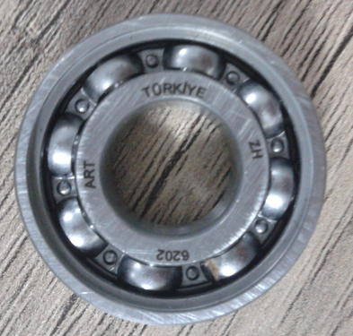
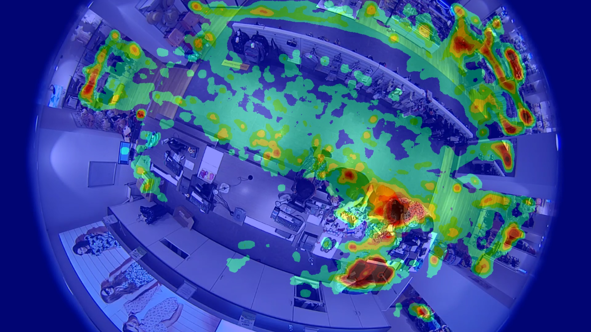

## Introduction
This repo contains works of CENG391 course,Introduction to Image Understanding, and my studies about computer vision area.

### Laboratory Works
Both C++ and Python's OpenCv library is used during laboratory studies of this course.The content of homeworks listed below.
* OpenCV Installation and Setup
* Basic data types and UI with OpenCV
* Smoothing & Sharpening operations
* Image compositing with Laplace pyramids
* Harris corner detection
* Image stitching for panorama generation
* Measuring the keypoint recognition rate, FAST & BRIEF
* Homography estimation, DLT
* Homography estimation with RANSAC

### Homeworks
* Manuel image correspondence
* Bilateral filter algorithm
* Bilinear interpolation
* Object detection with RANSAC
* Epipolar Line

### Internship Projects
* project_rollor_deformation_detection
  * This project is about finding deformation on rollers during production process in a factory. Normally, there are four different text on a roller. However, there may be some missing text due to production errors so the aim of this project is to find rollers that has missing text on it.
  

 
  
<b>Figure1:</b> A Roller sample
 

* project_balata_deformation_detection
  * This project is about finding deformation on rollers during production process in a factory. Normally, a product should has specific dimensions. However, dimensions of a product can change due to some production errors. This project aims to find products which don't have  desired dimensions.
    

 
    
<b>Figure2:</b> A sample product
 
 
* project_ffmpegCapture
  * This project implements capturing a camera stream using ffmpeg library of C++ language. OpenCv library has a videoCapture library for capturing videos. However, I tried to implement a C++ class to capture frames more efficiently.   
  
* project_count_people
  * This project aims to count number of people entered a shop during the day using camera stream.
  
* project_create_heatmap
  * This project aims to create heatmap of customers in a market. It creates heatmap for every hour in a day so it can be used to determine the most crowded hours of a day and the most used places in a market.
    

 
    
<b>Figure3:</b> Heatmap of a market using fisheye camera

  
  
